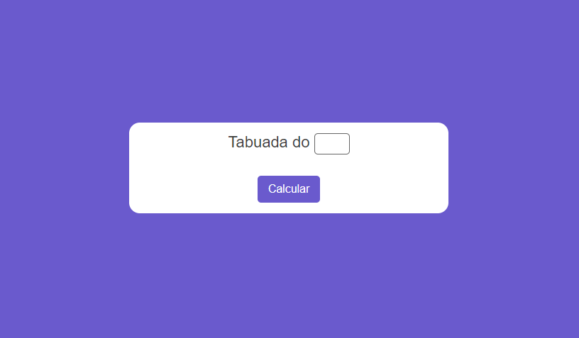

# Aplicativo de Tabuada

> A fantastic multiplication table design

> Enter a number and it will return you with a value of the same

> see the project : https://vtkaue.github.io/Aplicativo-de-Tabuada/

>  Aplicativo de Tabuada-Finalized

### Adjustments and improvements

The project is still under development and how updates will be focused on the following tasks:

- [x] HTML creation
- [x] CSS creation
- [x] JavaScript creation
- [x] layout update

## 🤝 Colaboradores

<table>
  <tr>
    <td align="center">
      <a href="#">
         
        
          <b>Victor Kauê</b>
        
      </a>
    </td>
  </tr>
</table>

[⬆ Voltar ao topo](#nome-do-projeto) 
